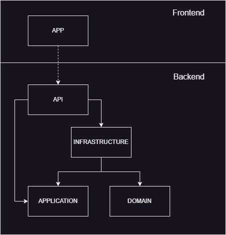

# DISCLAIMER

Este projeto tem por objetivo demonstrar habilidades no que se refere à boas práticas de desenvolvimento de software apenas. De forma alguma, trata-se de uma abordagem real ao problema proposto (validação de senha), que é muito simples e poderia ser resolvido com uma controller, principalmente considerando a performance da aplicação custo operacional e custo do desenvolvimento em si.

**Pontos de atenção:**
- O desafio requisita o output booleano porém, minha sugestão seria utilizar ``http response codes`` para prover uma resposta mais adequada ao browser;
- A implementação das classes ``PasswordServiceFactory`` e ``RegexStrategy`` não estão sendo utilizadas pois aqui neste contexto, não se faz necessário o uso de diferentes estratégias de validação de senha;
- A implementação do Strategy Pattern na classe ``PasswordService`` tem apenas o caráter de demonstração da sua implementação pois o método não acessa qualquer recurso externo que justifique tentativas de acesso. O recurso está dentro do contexto da aplicação.

# Requisitos

## Considere uma senha sendo válida quando a mesma possuir as seguintes definições:

- Nove ou mais caracteres;
- Ao menos 1 dígito;
- Ao menos 1 letra minúscula;
- Ao menos 1 letra maiúscula;
- Ao menos 1 caractere especial;
  - Considere como especial os seguintes caracteres: ``!@#$%^&*()-+``;
- Não possuir caracteres repetidos dentro do conjunto.

Exemplo:  

```c#
IsValid("") // false  
IsValid("aa") // false  
IsValid("ab") // false  
IsValid("AAAbbbCc") // false  
IsValid("AbTp9!foo") // false  
IsValid("AbTp9!foA") // false
IsValid("AbTp9 fok") // false
IsValid("AbTp9!fok") // true
```

> **_Nota:_**  Espaços em branco não devem ser considerados como caracteres válidos.

## Problema

Construa uma aplicação que exponha uma api web que valide se uma senha é válida.

**Input:** Uma senha (string).  
**Output:** Um boolean indicando se a senha é válida.

## Pontos abordados

### - Testes de unidade / integração
* Requisito atendido. Exemplos:<br />
    - O projeto WebApi possui testes de unidade;<br />
    - O projeto WebApp possui testes de integração.<br />

### - Abstração, acoplamento, extensibilidade e coesão
* Requisito atendido, além de outros conceitos de POO. Exemplos:<br />
    - **Abstração:** Abstração: A interface ``IPasswordService`` é um exemplo de abstração que define um contrato para validar senhas. Isso permite que diferentes implementações concretas sejam usadas, desde que sigam esse contrato;<br />
    - **Encapsulamento:** A classe ``Password`` encapsula a lógica de validação da senha. Ela define uma única responsabilidade e oculta os detalhes de implementação, permitindo que seja reutilizada sem a necessidade de conhecer a lógica interna;<br />
    - **Polimorfismo:** O polimorfismo é aplicado de forma indireta por meio do uso da interface ``IPasswordServiceFactory``. A classe ``PasswordController`` depende da interface, não de uma implementação específica, permitindo que diferentes serviços de validação de senha sejam usados sem modificar o código do controlador;<br />
    - **Composição:** A composição é aplicada no momento em que a classe ``PasswordController`` recebe uma instância de ``IPasswordServiceFactory`` por meio da injeção de dependência. A classe controladora é composta por um serviço de validação de senha, permitindo a reutilização e a fácil substituição dessa dependência;<br />
    - **Acoplamento:** A classe ``IPasswordService`` permite acoplamento aceitável quando usa apenas métodos públicos da classe ``PasswordService``;<br />
    - **Extensibilidade:** Oferecida pelas interfaces e injeções de dependências;
    - **Coesão:** Garantida pelas testes de unidade e integrados.<br />
    
### - Design de API
* Requisito atendido. Exemplos:<br />
    - A api do projeto backend possui documentação através do Swagger;<br />
    - Simplicidade e de fácil entendimento;<br />
    - Padrão RESTful utilizado;<br />
    - Possui versionamento;<br />
    - API assíncrona.<br />

### - Clean Code
* Requisito atendido. Exemplos:<br />
    - Os métodos possuem nomes auto explicativos;<br />
        - Ex.: ``IsValid_Returns_Expected_Result()``;<br />
    - Possuem objetivos únicos;<br />
    - Possuem testes que asseguram que o código funciona e é sustentável;<br />
    - Seguem boas práticas de componentização como a separação da apresentação e lógica em arquivos distintos.<br />

### - Domain-Driven Design (DDD)
* O conceito central do DDD é a separação clara entre o domínio da aplicação e as outras camadas. <br />
    - Uma pasta chamada ``PasswordValidator.Domain`` para encapsular toda a lógica relacionada à validação de senha. A classe ``Password`` dentro dessa pasta representa o modelo de domínio responsável pela validação da senha;<br />
    - Também foi criada a pasta ``PasswordValidator.Infrastructure`` para segregar a responsabilidade da factory ``PasswordServiceFactory`` e o service ``PasswordService``;<br />
    - Finalmente a pasta ``PasswordValidator.Application`` mantém o contrato ``IPasswordService`` isololado das outras camadas, proporcionando assim flexibilidade de implementação.<br />

### - Princípios SOLID
* Abordagem que visa promover a separação de responsabilidades, a modularidade, a extensibilidade e a manutenibilidade do código.<br />
    - **Princípio da Responsabilidade Única (SRP):** Cada classe tem uma única responsabilidade bem definida. Por exemplo, a classe ``Password`` tem a responsabilidade de validar senhas usando uma expressão regular;<br />
    - **Princípio do Aberto/Fechado (OCP):** A classe ``Password`` é facilmente estendida para adicionar novas regras de validação, sem precisar modificar seu código existente;<br />
    - **Princípio da Substituição de Liskov (LSP):** As interfaces e classes são projetadas de forma que possam ser substituídas por suas implementações concretas sem afetar o comportamento esperado. Por exemplo, a interface ``IPasswordServiceFactory`` permite que diferentes implementações do serviço de validação de senha sejam utilizadas sem impactar o código da ``PasswordController``;<br />
    - **Princípio da Segregação de Interfaces (ISP):** As interfaces são segregadas para atender apenas aos requisitos específicos das classes que as utilizam. A interface ``IPasswordService`` possui apenas o método necessário para validar senhas, evitando dependências desnecessárias;<br />
    - **Princípio da Inversão de Dependência (DIP):** As dependências são injetadas nas classes por meio de interfaces, permitindo a substituição fácil e a inversão do controle. A classe ``PasswordController`` depende da abstração ``IPasswordServiceFactory``, em vez de depender diretamente da implementação concreta ``PasswordServiceFactory``.<br />

### - Patterns
* Que foram abordados:<br />
    - **Dependency Injection (DI):** A interface ``IPasswordService`` é definida como uma dependência da classe ``PasswordController`` e é injetada através do construtor. Isso permite que diferentes implementações do serviço de validação de senha sejam facilmente substituídas sem modificar o código da controller. Além disso, a classe ``PasswordService`` é registrada como uma implementação concreta da interface ``IPasswordService`` no contêiner de DI do ASP.NET Core, que é configurado no arquivo ``Program.cs``;<br />
    - **Factory:** A interface ``IPasswordValidationServiceFactory`` é responsável por criar instâncias do serviço de validação de senha, permitindo que diferentes implementações da interface ``IPasswordService`` sejam criadas com base nos critérios definidos pela factory, permitindo maior flexibilidade e controle na criação de objetos;<br />
    - **Retry:** Este pattern foi implementado para proporcionar maior resiliência à aplicação WebAPI de validação de senha, possui uma lógica de repetição automatizada em caso de falhas temporárias. Isso pode ser feito modificando o código da classe ``PasswordService``.<br />

### - Documentação da solução no *README*
Requisito atendido.

# Diagrama da Solução - Visão de contexto



# Estrutura do Projeto backend

|--Back/<br />
&nbsp;&nbsp;|--src/<br />
&nbsp;&nbsp;&nbsp;&nbsp;|--PasswordValidator.API<br />
&nbsp;&nbsp;&nbsp;&nbsp;|--PasswordValidator.Application<br />
&nbsp;&nbsp;&nbsp;&nbsp;|--PasswordValidator.Domain<br />
&nbsp;&nbsp;&nbsp;&nbsp;|--PasswordValidator.Infrastructure<br />
&nbsp;&nbsp;&nbsp;&nbsp;|--PasswordValidator.Tests<br />
&nbsp;&nbsp;&nbsp;&nbsp;|--PasswordValidator.sln<br />

* O projeto backend webapi foi desenvolvido com .Net 7.0.3
    - Apenas o ambiente de desenvolvimento foi configurado;
    - Uma política de CORS genérica foi configurada para permitir o acesso via api
        ``app.UseCors(x => x.AllowAnyHeader().AllowAnyMethod().AllowAnyOrigin());``;
    - Uma classe chamada ``PasswordServiceFactory`` foi utilizada para dar suporte ao projeto de teste.

* O projeto de teste unitário de unidade utilizou xUnit 2.4.2 
    - O projeto de testes faz referência para:<br />
     ``..\PasswordValidator.API\PasswordValidator.API.csproj``<br />
     ``..\PasswordValidator.Infrastructure\PasswordValidator.Infrastructure.csproj``<br />
     ``..\PasswordValidator.Application\PasswordValidator.Application.csproj``<br />

## Comandos para rodar esse projeto

* WebApi<br />
    ``PasswordCheck\Back\src\PasswordValidator.API> dotnet run``<br />
    ``http://localhost:5062``<br />

* Swagger<br />
    ``http://localhost:5062/swagger/index.html``<br />

* Testes<br />
    ``PasswordCheck\Back\src\PasswordValidator.Tests> dotnet test``<br />

# Estrutura do Projeto frontend

|--Front/<br />
&nbsp;&nbsp;|--PassworkChecker-App/<br />
&nbsp;&nbsp;&nbsp;&nbsp;|--src/<br />
&nbsp;&nbsp;&nbsp;&nbsp;&nbsp;&nbsp;|--app/<br />
&nbsp;&nbsp;&nbsp;&nbsp;&nbsp;&nbsp;&nbsp;&nbsp;|--password-form<br />  

* O projeto frontend WebApp foi desenvolvido em: 
    - Angular CLI: 16.0.0;    
    - Node: 18.14.1;
    - Package Manager: npm 9.6.6.

## Comandos para rodar esse projeto

* WebApp<br />
    ``PasswordCheck\Front\PasswordChecker-App> npm start``<br />

* Testes<br />
    ``PasswordCheck\Front\PasswordChecker-App> npm test``<br />
    **IMPORTANTE!**<br />
    A api ``PasswordCheck\Back\src\PasswordValidator.API`` deve estar rodando e disponível na URL ``http://localhost:5062``.<br />

# Link do repositório público com a solução

Github: ``https://github.com/luishpp/PasswordCheck``
